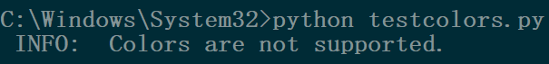

# printutils
**Various print utils for python3**

# General usage
The following is the start of what your scripts should look like:
```Python
import printutils as _p
printf = _p.oprintf   # Writes to stdout
printfe = _p.eprintf  # Writes to stderr
format = _p.format    # formats a string, useful for Exception(format(...))
# _p.outopt['end'] = '\n'  # always append a newline at the end, not always useful

# your code...
```
*In the following examples this header is left out!*

## printf -> printutils.oprintf
This function prints a string. Like format strings in python 3.6, variables can be accessed directly:

In python before version 3.6:
```Python
a = 5
print('{}'.format(a))
```

In python 3.6 or later:
```Python
a = 5
print(f'{a}')
```

In python before version 3.6 with printutils:
```Python
# <HEADER>
a = 5
printf('{a}\n')
```

## printfe -> printutils.eprintf
This function prints a string to stderr.

In python before version 3.6:
```Python
import sys
a = 5
sys.stderr.write('{}'.format(a))
```

In python 3.6 or later:
```Python
import sys
a = 5
sys.stderr(f'{a}')
```

In python before version 3.6 with printutils:
```Python
# <HEADER>
a = 5
printfe('{a}\n')
```

# Advantages
The printutils.oprintf, printutils.eprintf and printutils.format functions all have additional features:
+ `eval` inside fmtstr, wrapped in a julia-like syntax:
	'$(x)' or '$x', for more complex stuff (with spaces, brackets etc) '()' are required!
	```Python
	# <HEADER>
	a = 5
	printf('$(a is 5)\n')
	printf('a is currently $("not "*(a is not 5))five.\n')
	```
+ `exec` inside fmtstr:
	'!(x=5) or !x=', same as for '$'
	**NOTE:** printutils.allowExec must be set to True for this to work!
	**DANGER:** ONLY USE THIS IF YOU ***EXACTLY*** KNOW WHAT YOU ARE DOING! ***NEVER*** let users execute code like this!
	```Python
	# <HEADER>
	_p.allowExec = True
	a = 5
	printf('!(a = 6)\n')
	printf('a is currently $("not "*(a is not 5))five.\n')
	```
+ usual formatting:
	To use formatting options like you are used to like `'{0!r:0>8}'.format(a)`, use curly brackets:
	```Python
	# <HEADER>
	a = 5
	printf('{a!r: >8}\n')
	```
+ formatting:
	Using formatted and colored text is now easy:
	```Python
	# <HEADER>
	printfe('[bluefg;whitebg] INFO: [reset] Colors are $("not "*(1-useColors["all"]))supported.')
	```
	If colors aren't supported, the format specified will just be left out, printing an uncolored string:
	Windows:
	
	Linux / Windows Subsystem for Linux:
	

# Options
The following options are available:
```Python
printutils.retfmt  #               DEBUG option
printutils.outopt = {'end': ''}  # append this to every line that is printed, e.g. '\n'
printutils.allowExec = False  #    allow the execution of code
printutils.warnOnFail = True  #    if something fails, replace the original part, e.g. '$x', with '[FAILED: x]'
# printutils.useColors is set automatically. Use printutils.forceColors() to enable colors no matter if the system
# supports them. Output might look strange.
```
+ **retfmt**:
	If the function should return the string it prints. Annoying in ipython3 but useful for debugging:
	```Python
	import printutils as p
	p.returnFormatted = True
	log = open('log.txt', 'a')
	log.write(printf('This is important text that will be written to stdout and to a log file...\n'))
	# ...
	log.close()
	```
+ **outopt**:
	A dict passed to the output function (**outf**). By default it disables line endings.
	The default setting might change and it's recommended to set it to the desired value after the import.
+ **allowExec**:
	Allow the execution of code with format strings like '!(import os; os.system("rm -rf /"))'. Only enable
	this when you know what you're doing! (The example would erase a linux system installation...)
+ **warnOnFail**:
	If the evaluation of a substring fails, it will be replaced by '[FAILED]' (or '[EXECUTION DENIED]').
